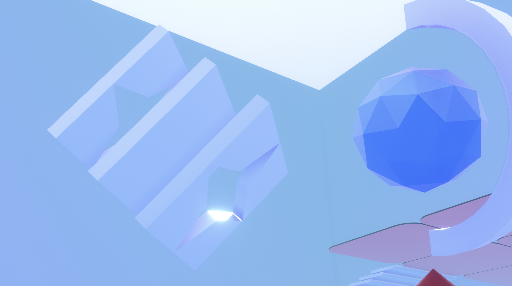
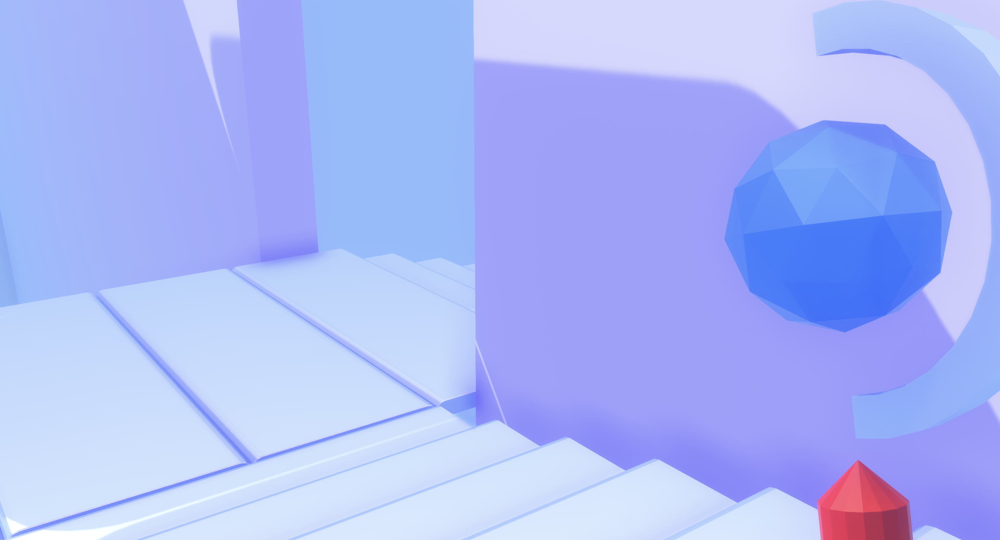
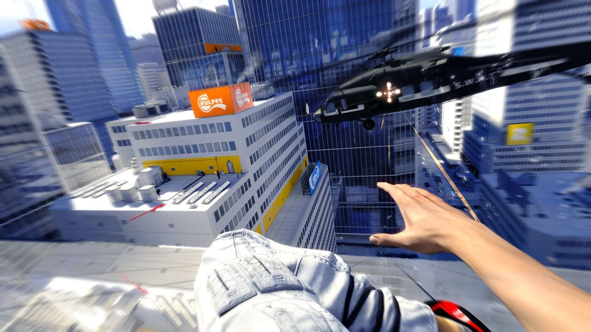
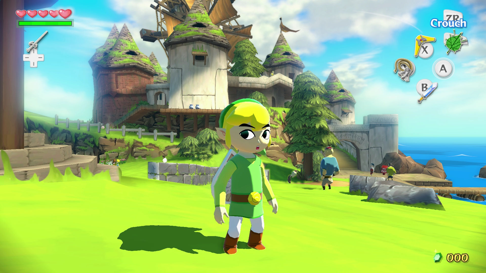
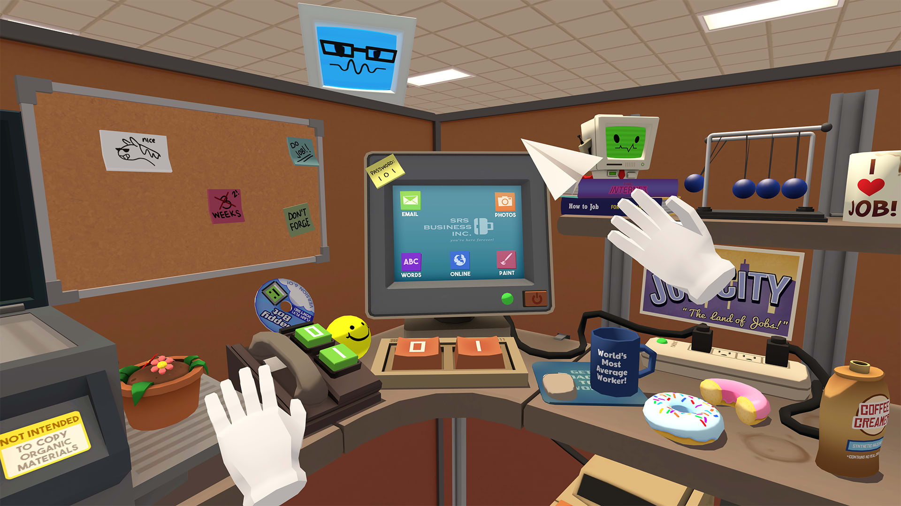

# Project Luminous

This is my first project in Unity.

# Why I made it this way

I wanted to learn unity in as little time as possible

My main interests were AR and VR, I don't have a VR Headset, and AR seemed pretty complex to learn for my very first project

I decided to begin with something more approachable that still had something in common with my real goal, something that would allow me to learn skills that would be useful even for AR/VR applications.

## What I wanted to learn

- Making 3D environments work in Unity
- Making 3D objects for this environment, that would react in some way to the actions of the player
- How to create interactions for both the player and the other entities of the game
- Making a multi-scene project work
- How to create and manage assets that need to feel consistent with each other.
- How to manage the lighting in Unity

## The Game (you just lost)

The closest thing obviously was a First Person Game.

I thought that a shooter would be a good place to start, because the logic behind shooting projectiles to me felt substantially easier to understand than a combat system akin to other action games (such as Zelda or Dark Souls)

The gameplay would consist of moving in a 3D environemt and fighting the enemies, the goal is to reach a specific room alive.

In its current state, the game is not even remotely complete, but I'm pretty satisfied with what I was able to accomplish it this limited time.

## The Style

I decide to self impose an additional challenge, I would make ALL the assets (at least the visual ones) by myself

I also wanted the game to have a consistent aesthetic, and considering this + the fact that I had to make MANY assets, I needed to come up with an artstyle that would look good DESPITE being pretty easy to make.

I chose a low poly aesthetic, and my prediction about it being easy to create ended up being true.

However, the artstyle is not just how the models are made, a good deal of the look of the game is derived by the lighting and the colors.

For this style, I was heavily inspired by games such as Mirror's Edge, The Legend of Zelda: Wind Waker and Job Simulator. They are all different games, but some of them (ESPECIALLY the first two) are universally considered to have a timeless aesthetic, mainly because of the smart ways in which they used lights and colors.

